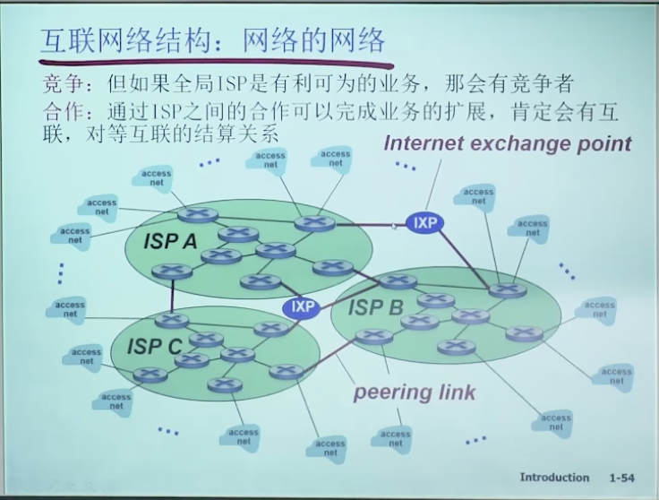

### 计算机网络复习笔记

##### **分层结构**

应用层

~~表示层~~

~~会话层~~

传输层：负责主机上进程之间的通信，主要有面向连接的TCP协议、无连接的UDP协议，TCP可靠性更强，UDP实时性更强。这些协议都加强了IP协议的可靠性。

网络层：负责端到端的传输，一般不可靠；包含IP协议和某些路由协议，由路由协议计算出路由表，供IP协议使用。

介质访问控制子层

数据链路层：负责点到点的传输。

物理层：建立在媒介层（第0层）之上。

##### 基本概念

**计算机网络定义：**将不同位置的多台自主计算机与通信设备和通信软件（操作系统、协议等）互联以进行资源共享的系统被称为计算机网络。

**分布式系统：**多台计算机对用户不可见，看起来像带有单个处理器的虚拟机。

目的是提高整体性能，强调多计算机系统整体性，各计算机协调自治工作，向用户呈现整体系统。

**计算机网络：**用户必须明确登录一台机器，明确远程提交作业，明确移动文件并亲自处理网络。

目的是共享资源，各计算机独立工作，向用户呈现分散系统。

分布式系统是建立在网络上的软件，该软件提供了高度内聚性和透明度，因此分布式系统和网络的区别主要存在于软件而非硬件。

**C-S模型：**客户端通过网络显式向托管信息的服务器请求信息，对服务器端的流量速度要求非常高，可扩展性差，大量客户端申请时，服务器的处理能力断崖式下降。

**P2P：**对等通信网络，覆盖网络，没有固定的客户端和服务器，可扩展性好，可以同时从多个主机获得资源，实现分布式的并行服务。

Peer-To-Peer，Peer指的是对等体，即分布式应用的一种 。

计算机网络中的**节点**：主机节点（客户端、服务器、移动终端等）、数据交换节点（中继器、交换机、路由器、负载均衡设备）

计算机网络中的**边**：称为链路，主机节点与交换节点间的链路叫接入链路，交换节点之间的叫骨干链路。

交换机是链路层的数据交换设备，路由器是网络层的数据交换设备。

**互联网：**是分布式应用和为分布式应用提供通信服务的基础设施。

基础设施：指网络应用层以下的所有部分。

边缘网络主机上的**分布式应用**是网络存在的理由；基础设施向上层应用提供的服务可以被分为两种：面向连接的（TCP IP）、无连接的（UDP）。 

面向连接的含义：在端系统要维护缓冲区、重传定时器等功能，底层协议栈分配相应的资源，为后面的传输行为做好准备。

**有连接和面向连接的区别：**有连接是指在网络的每一跳都要维护连接，面向连接是指只需要在端系统（分布式主机节点）维护连接，只有TCP实体能够意识到连接的存在。

**TCP的几个特性**：可靠性（不重复、不丢失、不失序）、流量控制（TCP实体自动 协调发送方和接收方的速度）、拥塞控制 （网络路径拥塞）。例如：文件传输应用、SMTP（email）。

**UDP无连接服务**： 一般不具有可靠性、流量控制、拥塞控制。 例如：域名解析查询DNS（事务性应用）、流媒体服务（实时性应用）。

##### 网络的横向组成：**接入网络、边缘网络、网络核心**。

**接入网络**：宽带接入网络、移动和无线接入网络。

住宅接入：

1. 传统调制解调器modem方式：在数据交换设备和用户两方各安装一个调制解调器，将上网的流量数据以调频、调幅、调相位等方式加载在**音频线缆**上访问网络。音频带宽小于4kHz，一般带宽很小，只有50kbps以下，电话与上网功能不能同时使用。

2. 改进modem方式：在原有的modem方式上发掘4kHz以上的音频带宽，4kHz以下的用于电话音频，以上的频段按照对称或非对称方式划分为两部分，分别用于上行和下行。对称的叫DSL，非对称叫ADSL（一般下行更宽）。可以一边通话一边上网。可以达到Mbps级别的带宽。DSL每个用户有专用的线路接入到CO（center office）。

3. 线缆网络：改造有线电视的同轴电缆或光纤，将只能下行的信号线缆双向改造，在不同频段传输不同信道的数据（FDM），同时传输数字电视和上网数据（上下行）（有线电视的不同频道实际上是频率的不同，是一种FDM），通常是共享上行带宽，是一种共享接入网络。

   一般是住宅用户通过cable modem方式接入到有线电视公司的headend，各用户共享到线缆头端的接入网络。

家庭内部：无线设备连接到无线接入点（wireless access point），ap和有线以太网设备仪器连接到路由器，路由器连接到cable modem或DSL modem，modem再连接到电信运营商的CO或有线电视运营商的headend。ap和路由器通常包含在一起。

无线接入网络：

1. 地面微波；

2. WLAN（wireless LAN）无线局域：

   建筑物内部，802.11（WiFi）

3. 无线广域：运营商提供，cellular（蜂窝网络），4G 5G接入到基站，再进入互联网；

4. 卫星通信：传播延迟非常高，不可忽略。

**网络核心**：路由器组成的网状网络。

为了解决数据经过网络核心的方式的问题，有两种基本方式：

1. **电路交换**：多用于电话网，通过信令（拨号）等控制信息建立起一条独享的线路，是一种预约服务，circuit Switch。

   特点：

   1. 通信线路资源独享，性能存在保障，但是存在资源浪费，资源共享能力差。

   2. 建立连接需要时间，对于计算机的通信行为不适合 。

   3. 交换节点之间的链路的带宽被分为多个片，分法有：

      频分复用 FDM：可用于电缆通信；

      波分复用 WDM：只用于光纤通信；

      时分复用 TDM：可用于电缆通信；

      ~~码分复用 CDM~~：用于接入网络，而非网络核心，称为CDMA 。
      
      在骨干网络中，交换节点之间没有Access，而在接入网络中存在Access，故以上几种分片方式在接入网络中被称为FDMA、WDMA、TDMA、CDMA。

   电路交换的缺点：

   1. 建立连接时间长

   2. 计算机之间通信有突发性，如果使用线路交换，浪费的片较多

   3. 可靠性不高，需要维护并保持数据交换节点Pair（主机对）与链路分片之间的对应关系（即通信关系），若某个核心交换节点出现故障，则网络会崩溃

2. **分组交换**：互联网基本都采用分组交换，是一种按需服务，packet Switch。

   特点：

   1. 每个Packet到达交换节点之后**先存储再转发**，若不存储转发，而是直接转发，则是占用所有带宽资源的线路交换，资源独占，没有共享。存储转发实现了通信线路的共享。

   2. 使用全部的链路带宽。

      **注意：分组交换实际上对链路使用了时分复用（TDM）的划分方式，但是划分时间片的方式随机，没有周期性，按需取用。这种特殊的TDM称为“统计多路复用”**

   3. 将主机间的通信数据分为多个Packet。

   优点：

   1. 按需使用，不会浪费带宽资源，适合于突发式数据传输。
   2. 支持的用户数量较电路交换更多，具有更好的共享性。
   3. 简单，不必建立呼叫，但是有可能要建立连接。

   缺点：

   1. 存储时延（相对确定时延）：相较于电路交换方法，分组交换在每个交换节点要先存储整个Packet；而电路交换只需要接收比特，转发比特，不需要存储。分组交换在交换节点花费更多时间和空间（存储Packet）。
   2. 排队时延（不确定时时延）：转发Packet时可能有其他分组在等待转发，要排队，耗费时间。
   3. 若排队过长，路由器（即交换节点）会主动丢弃分组，可靠的数据传输需要协议约束：拥塞控制。
   4. 转发前需要查找转发表，而电路交换预先建立了电路，不需要查表。

存储和发送只计算一次：对于分组交换方式，A发送一个bit，经过传播时延后到达B，B立即存储这个bit。对于B，到达即存储，接收即存储；对于A，发送即B存储。

分组交换计算总延迟时一般忽略排队延迟和处理（查表）延迟。

对于分组交换方式，数据报文大小为S bit，分组交换分组大小（即Packet大小）为P bit，带宽为Q bps，共有K段链路（跳），每段链路（跳）传播时延为D s，则总时延为：

延时分为：

1. 处理延时：微秒级别
2. 排队延时：取决于拥塞程度
3. 传输延时：L/R
4. 传播延时：介质中的传播时间

信道容量：在信道中传输着最大的数据量，可以用信道长度除以比特长度

分组交换网络按照**有无网络层的连接**，分为：

1. 数据报Datagram网络（**无连接**）：

   1. 每个分组携带完整的目标主机地址；

   2. 源主机与目标主机通信前不需要握手；
   3. 交换节点不维护主机间通信的状态（无状态路由器）；
   4. 每个分组独立传递，由于路由表的随时间更新，两主机之间的不同时刻的数据报可能经过不同的路径。

2. 虚电路网络（**有连接**）：（注意，虚电路不是面向连接，因为在所有的中间交换节点上都有通信状态的保存，**虚电路的有连接是网络层的连接**；TCP是**面向连接**的协议，因为连接只体现在端系统的TCP实体上，中间路由器不维护主机间的通信状态，这是传输层的连接）

   1. 主机通信前要握手；
   2. 交换节点保持主机间通信的状态，建立一条虚拟线路；
   3. 每个分组携带一个虚电路号，而不是完整的目标主机地址；
   4. 虚电路的建立也是依靠信令（控制信息）;
   5. 在传输过程中分组携带的虚电路号可能发生变化。

   

**电路交换VS分组交换，面向连接VS无连接：**

电路交换一定是面向连接的服务，而分组交换不一定是无连接的服务。

存在面向连接的服务，采用分组交换，比如TCP/IP协议实体，需要先建立连接，用完后释放连接。

互联网是分组交换的方式，但是随着互联网的发展，又需要某些线路交换方式的特性（固定带宽，性能保障，资源独享），故存在面向连接的分组交换方式。

**网络核心的关键功能**：

1. 转发：将分组从路由器输入链路转移到输出链路。（局部的功能）
2. 路由：决定分组才用的源到目标的路径。（全局功能）

**物理媒体：**导引型媒体1、2、3｜非导引型媒体4

1. 光纤：误码率低
2. 同轴电缆
3. 以太网线（双绞线）
4. 开放空间传输电磁波

##### **ICP（内容提供网络）——传输（骨干）网络——ISP（网络服务提供商）**

内容提供网络：数据中心网络、内容分发网络（分布式存储数据内容）

传输网络不一定必须，只有当内容提供商和ISP未直接相连时需要。

某些大型网络内容提供商会将自己的多个数据中心服务器DC建立在Global ISP的核心机房附近，这样当用户从接入ISP到达Global ISP时，可以很快的访问到想要的数据内容。而大型公司的数据中心服务器DC之间用专用线缆或租用线缆相连接，这样保证了分布式数据中心的数据调度速度和较低的成本。

ISP可以分为接入ISP——Access ISP和Global ISP，Global ISP将多个Access ISP连接起来，Access ISP又叫Access Net；多个Global ISP可以互联起来扩展其业务范围。

Global ISP之间的互联可以有两种方式：

1. 在两个ISP的某两个内部路由器之间连一条链路，两者对等(Peer)；

2. 多个ISP连接到同一个IXP，这种情况适用于多个ISP或者不对等情况。

   

上下级（Global与Access）ISP之间的连接方式：用POP（point of presence）连接起来，是不对等方式。

ISP层级划分：

1. Global ISP
1. Regional ISP
1. Local ISP
1. Access ISP
1. ~~终端~~

网络按照覆盖范围的划分：

**PAN 个域网**（蓝牙）；

**LAN 局域网**（有线交换以太网、无线802.11网络）；

**MAN 城域网**（电视或互联网信号线接到中央电缆头端，或电缆调制解调器，然后分发到各户）；

**WAN 广域网**（由子网将LAN连接起来）；

​	子网：由路由器、通信线路组成的集合，负责将数据包从源主机送到目标主机。

​	广域网举例：
​		1.租用专用线路；
​		2.构建在Internet上的VPN（虚拟专用网络）；
​		3.ISP互联网服务提供商；

**Internet 互联网** 由ISP这样的WAN作为互联网的骨干网，多个ISP互联，客户在边缘以多种方式连接组成的网络。相邻ISP在IXP（Internet交换点）处交换信息。

TTL：Time To Live 生存时间，标记报文现在还能跨越的链路数，即还能经过的跳数。

RTT：Round Trip Time 往返延时，表示从该主机到一个节点再回来的耗费时间。

分组丢失：因为链路的队列缓冲区容量有限。丢失的分组可能被上一个节点或源端系统重传，或不重传。 

WiFi的物理层不可靠，所以在数据链路层加入了可靠保障措施；以太网线在物理层可靠，是在数据链路层不加入可靠性保障。具体体现为：WiFi链路上传递一个报文，不收到应答报文就不停止发送，以太网传递报文不需要回传应答报文，WiFi链路上丢失后需要在上一个节点处重传，以太网上丢失数据是小概率事件，不会引发重传。

吞吐量：两个主机间传输的速率，数据量与时间的比值，没有其他主机或节点传输的情况下，一条路径上的有效吞吐量取决于速率最小的链路传输带宽；在有其他主机的情况下，每一条链路被n_i个主机对使用，只能分到带宽的1/n_i，则一条路径上的有效吞吐量取决于所有链路传输带宽/n_i中的最小值。

