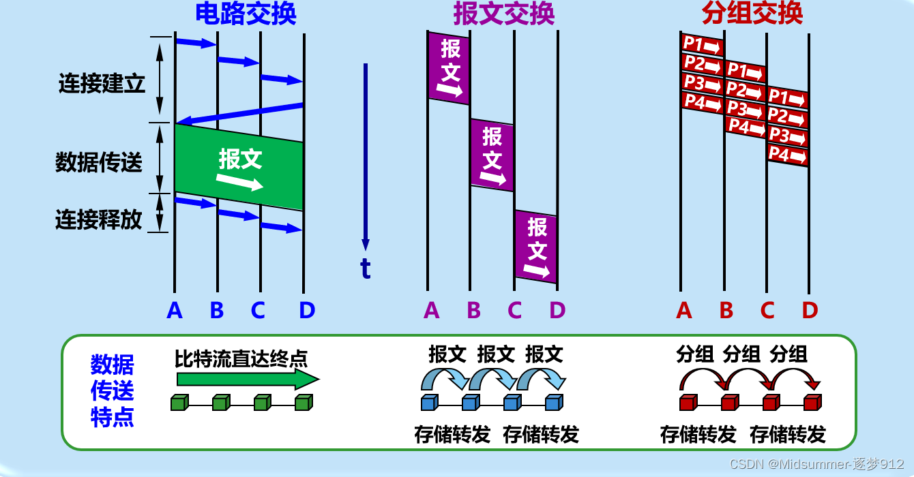

### 计算机网络复习笔记

**分层结构**

应用层

~~表示层~~

~~会话层~~

传输层：负责主机上进程之间的通信，主要有面向连接的TCP协议、无连接的UDP协议，TCP可靠性更强，UDP实时性更强。这些协议都加强了IP协议的可靠性。

网络层：负责端到端的传输，一般不可靠；包含IP协议和某些路由协议，由路由协议计算出路由表，供IP协议使用。

介质访问控制子层

数据链路层：负责点到点的传输。

物理层：建立在媒介层（第0层）之上。

**计算机网络定义：**将不同位置的多台自主计算机与通信设备和通信软件（操作系统、协议等）互联以进行资源共享的系统被称为计算机网络。

**分布式系统：**多台计算机对用户不可见，看起来像带有单个处理器的虚拟机。

目的是提高整体性能，强调多计算机系统整体性，各计算机协调自治工作，向用户呈现整体系统。

**计算机网络：**用户必须明确登录一台机器，明确远程提交作业，明确移动文件并亲自处理网络。

目的是共享资源，各计算机独立工作，向用户呈现分散系统。

分布式系统是建立在网络上的软件，该软件提供了高度内聚性和透明度，因此分布式系统和网络的区别主要存在于软件而非硬件。

**C-S模型：**客户端通过网络显式向托管信息的服务器请求信息，对服务器端的流量速度要求非常高，可扩展性差。

**P2P：**对等通信网络，覆盖网络，没有固定的客户端和服务器，可扩展性好，可以同时从多个主机获得资源，实现并行服务。

Peer-To-Peer，Peer指的是对等体，即分布式应用的一种 。

计算机网络中的**节点**：主机节点（客户端、服务器、移动终端等）、数据交换节点（中继器、交换机、路由器、负载均衡设备）

计算机网络中的**边**：称为链路，主机节点与交换节点间的链路叫接入链路，交换节点之间的叫骨干链路。

交换机是链路层的数据交换设备，路由器是网络层的数据交换设备。

**互联网：**是分布式应用和为分布式应用提供通信服务的基础设施。

**分布式应用**是网络存在的理由；基础设施向上层应用提供的服务可以被分为两种：面向连接的（TCP IP）、无连接的（UDP）。 

面向连接的含义：在端系统要维护缓冲区、重传定时器等功能。

**有连接和面向连接的区别：**有连接是指在网络的每一跳都要维护连接，面向连接是指只需要在端系统（分布式主机节点）维护连接。

**TCP的几个特性**：可靠性（不重复、不丢失、不失序）、流量控制（发送方和接收方的速度协商）、拥塞控制 （网络路径拥塞）。例如：文件传输应用、SMTP（email）。

**UDP无连接服务**： 一般不具有可靠性、流量控制、拥塞控制。 例如：域名解析查询DNS（事务性应用）、流媒体服务（实时性应用）。

网络的横向组成：**接入网络、边缘网络、网络核心**。

**接入网络**：宽带接入网络、移动和无线接入网络、

**网络核心**：路由器组成的网状网络。

为了解决数据经过网络核心的方式的问题，有两种基本方式：

1. **电路交换**：多用于电话网，通过信令（拨号）等控制信息建立起一条独享的线路circuit Switch。

   特点：

   1. 通信线路资源独享，性能存在保障，但是存在资源浪费，资源共享能力差。

   2. 建立连接需要时间，对于计算机的通信行为不适合 。

   3. 交换节点之间的链路的带宽被分为多个片，分法有：

      频分复用 FDM：可用于电缆通信；

      波分复用 WDM：只用于光纤通信；

      时分复用 TDM：可用于电缆通信；

      码分复用 CDM ：主要用于接入网络，称为CDMA 。
      
      在骨干网络中，交换节点之间没有Access，而在接入网络中存在Access，故以上几种分片方式在接入网络中被称为FDMA、WDMA、TDMA、CDMA。

   电路交换的缺点：

   1. 建立连接时间长

   2. 计算机之间通信有突发性，如果使用线路交换，浪费的片较多

   3. 可靠性不高，需要维护并保持数据交换节点Pair与链路分片之间的对应关系，若某个核心交换节点出现故障，则网络会崩溃

2. **分组交换**：互联网基本都采用分组交换Packet Switch。

   特点：

   1. 每个Packet到达交换节点之后**先存储再转发**，若不存储转发，而是直接转发，则是占用所有带宽资源的线路交换，资源独占，没有共享。存储转发实现了通信线路的共享。
   2. 使用全部的链路带宽。
   3. 将主机间的通信数据分为多个Packet。

   优点：

   1. 按需使用，不会浪费带宽资源。

   缺点：

   1. 存储时延（相对确定时延）：相较于电路交换方法，分组交换在每个交换节点要先存储整个Packet；而电路交换只需要接收比特，转发比特，不需要存储。分组交换在交换节点花费更多时间和空间（存储Packet）。
   2. 排队时延（不确定时时延）：转发Packet时可能有其他分组在等待转发，要排队，耗费时间。
   3. 转发前需要查找转发表，而电路交换预先建立了电路，不需要查表。

**电路交换VS分组交换，面向连接VS无连接：**

电路交换一定是面向连接的服务，而分组交换不一定是无连接的交换。

存在面向连接的服务，采用分组交换，比如TCP/IP协议实体，需要先建立连接，用完后释放连接。

**内容提供网络——传输（骨干）网络——ISP（网络服务提供商）**

内容提供网络：数据中心网络、内容分发网络（分布式存储数据内容）

传输网络不一定必须，只有当内容提供商和ISP未直接相连时需要。

网络按照覆盖范围的划分：

**PAN 个域网**（蓝牙）；

**LAN 局域网**（有线交换以太网、无线802.11网络）；

**MAN 城域网**（电视或互联网信号线接到中央电缆头端，或电缆调制解调器，然后分发到各户）；

**WAN 广域网**（由子网将LAN连接起来）；

​	子网：由路由器、通信线路组成的集合，负责将数据包从源主机送到目标主机。

​	广域网举例：
​		1.租用专用线路；
​		2.构建在Internet上的VPN（虚拟专用网络）；
​		3.ISP互联网服务提供商；

**Internet 互联网** 由ISP这样的WAN作为互联网的骨干网，多个ISP互联，客户在边缘以多种方式连接组成的网络。相邻ISP在IXP（Internet交换点）处交换信息，

