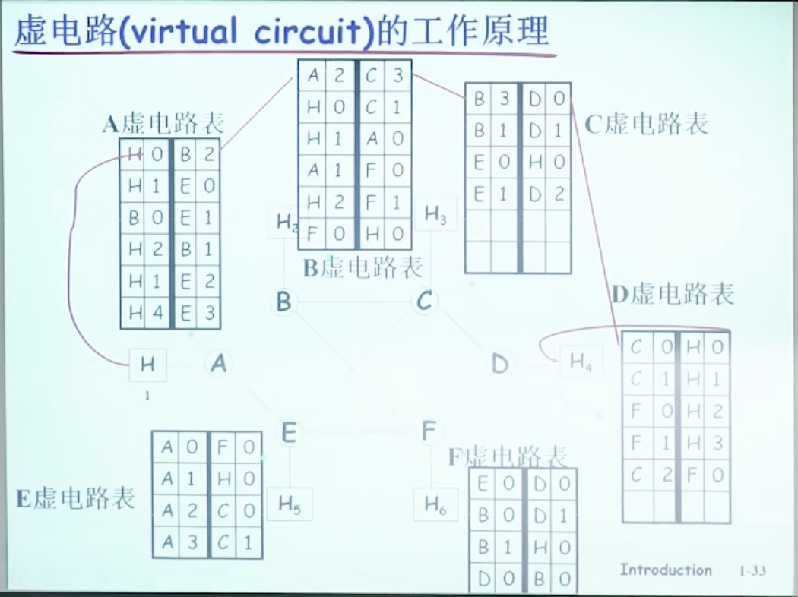

### 计算机网络复习笔记

##### **分层结构**

应用层

~~表示层~~

~~会话层~~

传输层：负责主机上进程之间的通信，主要有面向连接的TCP协议、无连接的UDP协议，TCP可靠性更强，UDP实时性更强。这些协议都加强了IP协议的可靠性。

​	屏蔽通信子网的差异，使上层不受通信子网影响；

​	弥补应用层与通信子网的差异；

​	提供进程级通信能力。

网络层：负责端到端的传输，一般不可靠；包含IP协议和某些路由协议，由路由协议计算出路由表，供IP协议使用。

​	寻址：IP地址；

​	路由选择；

​	数据的分组转发；

​	流量控制；

​	拥塞控制；

​	差错控制。

介质访问控制子层

数据链路层：负责点到点的传输。

​	物理地址；

​	成帧长短；

​	定界与同步；

​	差错控制；

​	流量控制；

​	信道访问控制。

物理层：建立在媒介层（第0层）之上。

##### 基本概念

**计算机网络定义：**将不同位置的多台自主计算机与通信设备和通信软件（操作系统、协议等）互联以进行资源共享的系统被称为计算机网络。

**分布式系统：**多台计算机对用户不可见，看起来像带有单个处理器的虚拟机。

目的是提高整体性能，强调多计算机系统整体性，各计算机协调自治工作，向用户呈现整体系统。

**计算机网络：**用户必须明确登录一台机器，明确远程提交作业，明确移动文件并亲自处理网络。

目的是共享资源，各计算机独立工作，向用户呈现分散系统。

分布式系统是建立在网络上的软件，该软件提供了高度内聚性和透明度，因此分布式系统和网络的区别主要存在于软件而非硬件。

**C-S模型：**客户端通过网络显式向托管信息的服务器请求信息，对服务器端的流量速度要求非常高，可扩展性差，大量客户端申请时，服务器的处理能力断崖式下降。

**P2P：**对等通信网络，覆盖网络，没有固定的客户端和服务器，可扩展性好，可以同时从多个主机获得资源，实现分布式的并行服务。

Peer-To-Peer，Peer指的是对等体，即分布式应用的一种 。

计算机网络中的**节点**：主机节点（客户端、服务器、移动终端等）、数据交换节点（中继器、交换机、路由器、负载均衡设备）

计算机网络中的**边**：称为链路，主机节点与交换节点间的链路叫接入链路，交换节点之间的叫骨干链路。

交换机是链路层的数据交换设备，路由器是网络层的数据交换设备。

**互联网：**是分布式应用和为分布式应用提供通信服务的基础设施。

基础设施：指网络应用层以下的所有部分。

边缘网络主机上的**分布式应用**是网络存在的理由；基础设施向上层应用提供的服务可以被分为两种：面向连接的（TCP IP）、无连接的（UDP）。 

面向连接的含义：在端系统要维护缓冲区、重传定时器等功能，底层协议栈分配相应的资源，为后面的传输行为做好准备。

**有连接和面向连接的区别：**有连接是指在网络的每一跳都要维护连接，面向连接是指只需要在端系统（分布式主机节点）维护连接，只有TCP实体能够意识到连接的存在。

**TCP的几个特性**：可靠性（不重复、不丢失、不失序）、流量控制（TCP实体自动 协调发送方和接收方的速度）、拥塞控制 （网络路径拥塞）。例如：文件传输应用、SMTP（email）。

**UDP无连接服务**： 一般不具有可靠性、流量控制、拥塞控制。 例如：域名解析查询DNS（事务性应用）、流媒体服务（实时性应用）。

##### 网络的横向组成：**接入网络、边缘网络、网络核心**。

**接入网络**：宽带接入网络、移动和无线接入网络。

住宅接入：

1. 传统调制解调器modem方式：在数据交换设备和用户两方各安装一个调制解调器，将上网的流量数据以调频、调幅、调相位等方式加载在**音频线缆**上访问网络。音频带宽小于4kHz，一般带宽很小，只有50kbps以下，电话与上网功能不能同时使用。

2. 改进modem方式：在原有的modem方式上发掘4kHz以上的音频带宽，4kHz以下的用于电话音频，以上的频段按照对称或非对称方式划分为两部分，分别用于上行和下行。对称的叫DSL，非对称叫ADSL（一般下行更宽）。可以一边通话一边上网。可以达到Mbps级别的带宽。DSL每个用户有专用的线路接入到CO（center office）。

3. 线缆网络：改造有线电视的同轴电缆或光纤，将只能下行的信号线缆双向改造，在不同频段传输不同信道的数据（FDM），同时传输数字电视和上网数据（上下行）（有线电视的不同频道实际上是频率的不同，是一种FDM），通常是共享上行带宽，是一种共享接入网络。

   一般是住宅用户通过cable modem方式接入到有线电视公司的headend，各用户共享到线缆头端的接入网络。

家庭内部：无线设备连接到无线接入点（wireless access point），ap和有线以太网设备仪器连接到路由器，路由器连接到cable modem或DSL modem，modem再连接到电信运营商的CO或有线电视运营商的headend。ap和路由器通常包含在一起。

无线接入网络：

1. 地面微波；

2. WLAN（wireless LAN）无线局域：

   建筑物内部，802.11（WiFi）

3. 无线广域：运营商提供，cellular（蜂窝网络），4G 5G接入到基站，再进入互联网；

4. 卫星通信：传播延迟非常高，不可忽略。

**网络核心**：路由器组成的网状网络。

为了解决数据经过网络核心的方式的问题，有两种基本方式：

1. **电路交换**：多用于电话网，通过信令（拨号）等控制信息建立起一条独享的线路，是一种预约服务，circuit Switch。

   特点：

   1. 通信线路资源独享，性能存在保障，但是存在资源浪费，资源共享能力差。

   2. 建立连接需要时间，对于计算机的通信行为不适合 。

   3. 交换节点之间的链路的带宽被分为多个片，分法有：

      频分复用 FDM：可用于电缆通信；

      波分复用 WDM：只用于光纤通信；

      时分复用 TDM：可用于电缆通信；

      ~~码分复用 CDM~~：用于接入网络，而非网络核心，称为CDMA 。
      
      在骨干网络中，交换节点之间没有Access，而在接入网络中存在Access，故以上几种分片方式在接入网络中被称为FDMA、WDMA、TDMA、CDMA。

   电路交换的缺点：

   1. 建立连接时间长

   2. 计算机之间通信有突发性，如果使用线路交换，浪费的片较多

   3. 可靠性不高，需要维护并保持数据交换节点Pair（主机对）与链路分片之间的对应关系（即通信关系），若某个核心交换节点出现故障，则网络会崩溃

2. **分组交换**：互联网基本都采用分组交换，是一种按需服务，packet Switch。

   特点：

   1. 每个Packet到达交换节点之后**先存储再转发**，若不存储转发，而是直接转发，则是占用所有带宽资源的线路交换，资源独占，没有共享。存储转发实现了通信线路的共享。

   2. 使用全部的链路带宽。

      **注意：分组交换实际上对链路使用了时分复用（TDM）的划分方式，但是划分时间片的方式随机，没有周期性，按需取用。这种特殊的TDM称为“统计多路复用”**

   3. 将主机间的通信数据分为多个Packet。

   优点：

   1. 按需使用，不会浪费带宽资源，适合于突发式数据传输。
   2. 支持的用户数量较电路交换更多，具有更好的共享性。
   3. 简单，不必建立呼叫，但是有可能要建立连接。

   缺点：

   1. 存储时延（相对确定时延）：相较于电路交换方法，分组交换在每个交换节点要先存储整个Packet；而电路交换只需要接收比特，转发比特，不需要存储。分组交换在交换节点花费更多时间和空间（存储Packet）。
   2. 排队时延（不确定时时延）：转发Packet时可能有其他分组在等待转发，要排队，耗费时间。
   3. 若排队过长，路由器（即交换节点）会主动丢弃分组，可靠的数据传输需要协议约束：拥塞控制。
   4. 转发前需要查找转发表，而电路交换预先建立了电路，不需要查表。

存储和发送只计算一次：对于分组交换方式，A发送一个bit，经过传播时延后到达B，B立即存储这个bit。对于B，到达即存储，接收即存储；对于A，发送即B存储。

分组交换计算总延迟时一般忽略排队延迟和处理（查表）延迟。

对于分组交换方式，数据报文大小为S bit，分组交换分组大小（即Packet大小）为P bit，带宽为Q bps，共有K段链路（跳），每段链路（跳）传播时延为D s，则总时延为：

延时分为：

1. 处理延时：微秒级别
2. 排队延时：取决于拥塞程度
3. 传输延时：L/R
4. 传播延时：介质中的传播时间

信道容量：在信道中传输着最大的数据量，可以用信道长度除以比特长度

分组交换网络按照**有无网络层的连接**，分为：

1. 数据报Datagram网络（**无连接**）：

   1. 每个分组携带完整的目标主机地址；

   2. 源主机与目标主机通信前不需要握手；
   3. 交换节点不维护主机间通信的状态（无状态路由器）；
   4. 每个分组独立传递，由于路由表的随时间更新，两主机之间的不同时刻的数据报可能经过不同的路径。

2. 虚电路网络（**有连接**）：（注意，虚电路不是面向连接，因为在所有的中间交换节点上都有通信状态的保存，**虚电路的有连接是网络层的连接**；TCP是**面向连接**的协议，因为连接只体现在端系统的TCP实体上，中间路由器不维护主机间的通信状态，这是传输层的连接）

   1. 主机通信前要握手；
   2. 交换节点保持主机间通信的状态，建立一条虚拟线路；
   3. 每个分组携带一个虚电路号，而不是完整的目标主机地址；
   4. 虚电路的建立也是依靠信令（控制信息）;
   5. 在传输过程中分组携带的虚电路号可能发生变化。

   

**电路交换VS分组交换，面向连接VS无连接：**

电路交换一定是面向连接的服务，而分组交换不一定是无连接的服务。

存在面向连接的服务，采用分组交换，比如TCP/IP协议实体，需要先建立连接，用完后释放连接。

互联网是分组交换的方式，但是随着互联网的发展，又需要某些线路交换方式的特性（固定带宽，性能保障，资源独享），故存在面向连接的分组交换方式。

**网络核心的关键功能**：

1. 转发：将分组从路由器输入链路转移到输出链路。（局部的功能）
2. 路由：决定分组才用的源到目标的路径。（全局功能）

**物理媒体：**导引型媒体1、2、3｜非导引型媒体4

1. 光纤：误码率低
2. 同轴电缆
3. 以太网线（双绞线）
4. 开放空间传输电磁波

##### **ICP（内容提供网络）——传输（骨干）网络——ISP（网络服务提供商）**

内容提供网络：数据中心网络、内容分发网络（分布式存储数据内容）

传输网络不一定必须，只有当内容提供商和ISP未直接相连时需要。

某些大型网络内容提供商会将自己的多个数据中心服务器DC建立在Global ISP的核心机房附近，这样当用户从接入ISP到达Global ISP时，可以很快的访问到想要的数据内容。而大型公司的数据中心服务器DC之间用专用线缆或租用线缆相连接，这样保证了分布式数据中心的数据调度速度和较低的成本。

ISP可以分为接入ISP——Access ISP和Global ISP，Global ISP将多个Access ISP连接起来，Access ISP又叫Access Net；多个Global ISP可以互联起来扩展其业务范围。

Global ISP之间的互联可以有两种方式：

1. 在两个ISP的某两个内部路由器之间连一条链路，两者对等(Peer)；

2. 多个ISP连接到同一个IXP，这种情况适用于多个ISP或者不对等情况。

   

上下级（Global与Access）ISP之间的连接方式：用POP（point of presence）连接起来，是不对等方式。

ISP层级划分：

1. Global ISP
1. Regional ISP
1. Local ISP
1. Access ISP
1. ~~终端~~

网络按照覆盖范围的划分：

**PAN 个域网**（蓝牙）；

**LAN 局域网**（有线交换以太网、无线802.11网络）；

**MAN 城域网**（电视或互联网信号线接到中央电缆头端，或电缆调制解调器，然后分发到各户）；

**WAN 广域网**（由子网将LAN连接起来）；

​	子网：由路由器、通信线路组成的集合，负责将数据包从源主机送到目标主机。

​	广域网举例：
​		1.租用专用线路；
​		2.构建在Internet上的VPN（虚拟专用网络）；
​		3.ISP互联网服务提供商；

**Internet 互联网** 由ISP这样的WAN作为互联网的骨干网，多个ISP互联，客户在边缘以多种方式连接组成的网络。相邻ISP在IXP（Internet交换点）处交换信息。

TTL：Time To Live 生存时间，标记报文现在还能跨越的链路数，即还能经过的跳数。

RTT：Round Trip Time 往返延时，表示从该主机到一个节点再回来的耗费时间。

分组丢失：因为链路的队列缓冲区容量有限。丢失的分组可能被上一个节点或源端系统重传，或不重传。 

WiFi的物理层不可靠，所以在数据链路层加入了可靠保障措施；以太网线在物理层可靠，是在数据链路层不加入可靠性保障。具体体现为：WiFi链路上传递一个报文，不收到应答报文就不停止发送，以太网传递报文不需要回传应答报文，WiFi链路上丢失后需要在上一个节点处重传，以太网上丢失数据是小概率事件，不会引发重传。

吞吐量：两个主机间传输的速率，数据量与时间的比值，没有其他主机或节点传输的情况下，一条路径上的有效吞吐量取决于速率最小的链路传输带宽；在有其他主机的情况下，每一条链路被n_i个主机对使用，只能分到带宽的1/n_i，则一条路径上的有效吞吐量取决于所有链路传输带宽/n_i中的最小值。

协议的实现需要通过层间接口通过访问下层提供的服务，协议的目的是向上层提供更多功能的更优质的服务。

每层协议向上层提供的服务包括它的下层提供的所有服务的总和，还包括与对等层实体一起向上层提供的新的特性。

socket api是传输层向应用层提供的服务。

服务提供者、服务用户和服务访问点SAP：一个协议实体（即服务提供者）为多个服务用户提供服务，在服务访问点向服务用户用原语提供专有的服务。

各层的PDU（协议数据单元）的名称：

1. 应用层：报文

2. 传输层：报文段、段（TCP段、UDP数据报）
3. 网络层：分组（若无连接叫数据报）
4. 链路层：帧
5. 物理层：bit

链路层和物理层一般被封装在同一张网卡中。

移动网络（无线广域）：

1G：模拟信号

2G：数字信号

3G：语音和宽带服务：基于空间单元，每个空间单元内通过基站向空间中的无线设备提供服务，为管理用户之间的无线干扰，将空间单元划分为六边形蜂窝状

4G：后期的4G被称为长期演进技术

无线电广播互相干扰，信号覆盖范围相互重叠。——CSMA被使用

无线网络：

无线局域网（WLAN），标准称为802.11，802.11的两种不同的通信模式：

1. 客户端接入到AP，访问互联网，AP被接入到了网络其余部分；
2. Ad hoc：客户端在一个无线环中访问其余主机，不接入其他网络。

网络协议的设计目标：

1. 可靠性：从错误中恢复的能力

   检错能力、纠错能力

   使用路由在网络中查找路径

2. 资源分配：共享对共同、有限资源的访问权限

   可扩展性、多路复用

   流量控制

   拥塞控制

   服务质量的调和

3. 可进化性：允许随时间逐步改进协议

4. 安全：保护网络免受攻击

   保密机制：防止监听

   认证机制：防止冒充

   完整机制：防止篡改数据

物理层是第一层，协议栈模型中组成不同机器上相应层的实体称为对等体

协议：通信双方就如何进行通信的一种约定。

1. 语法

   格式、控制信息

2. 语义

   通信进行的方式

3. 时序

   收到包后是否发短信

协议分层结构的好处：

1. 各层独立
2. 灵活性好：任意层发生变化，只要接口不变，上下层不受影响
3. 结构上分开
4. 易于实现和维护
5. 促进标准化

每一层要关注：

1. 通信地址
2. 差错控制：检错、纠错
3. 流量控制：发送与接收方相互协调
4. 多路复用
5. 路由

面向连接：当连接建立时，谈判，协调上方通信时要使用的一些值和参数（例如最大消息长度，这与QoS有关）

有连接：可靠，顺序性好

无连接：不可靠，顺序性差

可靠与否：一般是接受方向发送方发送一个确认消息。

##### 物理层

物理层定义了网络的机械、电气和定时接口，提供了将比特从发送器传输到接收器的方法，涉及大量如何使用（模拟）信号获取数字信息。

引导传输介质：

1. 永久存储设备

2. 双绞线：屏蔽双绞线（7类、8类）、非屏蔽双绞线（3类、5类、6类），全双工：双向同时使用；半双工：可以双向，但是同时只能单向；单工：只允许一个方向上流过流量

3. 同轴电缆：铜芯、绝缘材料、编织导体

4. 电力线：高速率的数据通信需要高频率，会发生衰减，数据信号叠加在低频电力信号上

5. 光纤：

   1. 基本允许无限带宽；

   2. 铺设成本高；

   3. 用途：网络主干网中的长途传输，高速局域网、高速互联网接入；

   4. 组件：光源（LED或激光器）、传输介质、检测器；

   5. 光波衰减，取决于波长；

   6. 多模光纤：可以以不同的角度反射；

      单模光纤：光纤直径只有几个波长长，只能按直线传播，直径小，衰耗小；

   7. 优点：带宽高、不受电力故障、化学腐蚀影响、轻巧、不漏光

   8. 缺点：需要较高的安装技术、易弯折损坏

非引导传输介质：

1. 电磁频谱：调频、调幅、调相位；
2. 跳频扩频；
3. 直接序列扩频；
4. 超宽频带。

频谱用于传输：

1. 无线电：易于产生、**全向波**、传输距离长、可以穿透建筑物；
2. 微波：需要中继器的**定向波**、不能穿透建筑，会多径衰减；
3. 红外传输：无制波用于短距离通信，相对定向，便宜，易于构建，不穿透实心墙壁；

波特率：B，物理信号传输速度；比特率：s，传输的有效数据速度

s = B * log_2v = 1/T * log_2v（v是信号值的数量）

##### 信道的最大数据速率：

奈奎斯特定律：

- 对于无噪声信道，带宽上限为BHz的信道的最大数据传输率为2Blog_2v，只需要每秒2B次采样，就可以完全重构被过滤的信号。

信噪比SNR = 信号的功率S / 噪声功率N用对数表示为10log_10 S/N分贝

信噪比10对应10dB，信噪比100对应20dB。

香农定律：

- 最大数据速率 = Blog_2(1+S/N)	带宽为B，信噪比S/N

数字调制：比特与代表他们的信号之间的转换过程称为数字调制。

基带传输：在0～最大值的频率之间传输；

通带传输：在给定的频带中传输信号。

码分复用：CDMA（3G中使用较多）

- 是一种扩展频谱的方式，将窄带信号扩展到宽频带上，允许多个用户的多个信号共享相同的频带，因此常称为码分多址（CDMA）
- 一比特时间被分为多个码片chip，每个站被分配唯一的码片序列，要传送1，就发送该码片序列，要传送0就发送该码片序列的反码。
- 对带宽的要求更高，带宽是一般基站的m倍
- 总体的码片是所有站发出的码片的叠加，要恢复某个站是否发送、发送的位，只需要将现在收到的码片与目标基站的码片内积，再除以m，结果可能是1、-1、0.

波分复用是频分复用的一种形式，利用光的不同波长在光纤上实现多个型号的复用。

电话系统中，骨干网是数字信号，接入网络是模拟信号。

T1载波：24路信道时分复用到T1是按字节复用，每路信道传输8位，即一字节，T1载波时分复用到T2载波是按照比特复用的，每个T1载波每次传输一位。其速率：(24\*8+1)\*8000 = 1.544Mbps.

数字传输复用速率标准不统一，提出了同步光纤网SONET：

- 每125微秒，SONET发送810字节（9行90列的字节矩阵，前三列用于系统管理信息的开销），速率是：

  8\*810\*8000=51.84Mbps，同步有效载荷=51.84*87/90=50.112M

电话系统分为局外与局内，局外是本地回路与中继线，局内包含两种交换方式：电路交换与数据包交换。

电路交换与数据包交换相比，两者可能发生拥塞的时间不同，电路交换发生在线路建立时，数据包交换发生在发送数据包时。

相邻的蜂窝网之间不能重用频率。

1G：模拟信号

蜂窝网络分为四种信道：控制信道（基站到移动端，管理系统）、寻呼信道（唤醒用户，基站到移动端）、接入信道（建立连接，双向）、数据信道（传输数据，双向）

2G：数字信号

GSM使用124个频道，每个频道分为8个时间槽，每个频道宽200kHz，8个数据帧构成一个TDM帧，26个TDM帧构成多帧，第12TDM帧负责控制（CTL），第25号帧空闲，有24个用户TDM帧。一个数据帧148比特。

3G

CDMA容量大， 充分利用当有一些发射器沉默时的小周期，当用户不在忙状态时，简单的不给对方发送信号，就能减少干扰。不需要像TDM、FDM考虑重新分配时间槽或频率信道来利用这些小的沉默周期。

4G

数据包交换

EPC（演进的数据包核心）网络允许数据包交换；在IP数据包中包含语音与数据，但是将两者分开，是一个VoIP网络，使用统计多路复用。

5G

高速率与低延迟

轨道卫星：

低轨（中继方式：空中中继方式和地面中继方式）、中轨（GPS运行在这里）、同步卫星（270mm延迟）

数据链路层

流量控制、差错控制

成帧：帧包含帧头帧尾，中间是上层传下的数据包

1. 无确认的无连接服务：源主机向目标主机发送**独立帧**，不发回确认。例子为以太网。丢帧之后不会试图重新发送，也不检测丢帧。适用于错误率（误码率）低的链路，差错恢复留给上层完成；也适用于实时流量，不需要确认，延迟更低。
2. 有确认的无连接服务：没有使用逻辑连接，每一帧单独确认，发送方可以知道每个帧是否安全送达，若一段时间间隔没有送达则重传。适用于不可靠信道，如无线连接，WiFi。
3. 有确认的面向连接服务：最为复杂。在传输数据之前要建立连接，对帧要编号，确保发出的每一帧都要被接受，保证每一帧只被接受一次，按顺序被接受，相当于为网络层提供可靠比特流。适用于长距离不可靠链路，卫星信道或长途电话。相比有确认的无连接服务，若一确认帧丢失则要导致被收发多次，浪费带宽。三个阶段，第一阶段建立连接，初始化发送和接收窗口，第二个阶段传输帧，第三个阶段释放连接。

确认应答信号：正向应答（回答正确的）、负向应答（回答出错的）、双向应答。

传输中：正确、出错、丢失。

最常采用：正向应答。

成帧：原则为易于区分，占用的信道带宽少。

1. 字节计数：帧头一个字段标记帧字符数，若一个帧的字符计数出错，则后续均出错。
2. 字节填充的标志字节法：在帧头帧尾加FLAG字节，在原本的FLAG字节前填充ESC字节，在原有的ESC字节前填充ESC字节。每一帧单独定界，定界错误不会向后传播。
   1. 局限于8位字符和ASCII字符串送，不被普遍采用；
   2. 信道利用率低；
   3. 监视位串，处理复杂，需要修改有效载荷。
3. 比特填充的标志比特法：帧头帧尾用特殊串01111110标记，遇到连续5个1在后面补上0（填充）.
4. 物理层编码例外法：用物理层编码的冗余实现。曼彻斯特编码的高高或低低来定界。
   1. 有冗余的编码方式才能使用。
   2. 不用填充，信道利用率高。

流量控制：

1. 基于反馈的流量控制：反馈信息，可以被使用在链路层或以上。
2. 基于速率的流量控制：仅在传输层被使用。

错误控制：

1. 信道的电气特性引起信号幅度、频率、相位畸变。
2. 信号反射、串扰。
3. 闪电、大功率电机启停。

纠错码（前向纠错）、检错码。

纠错码：

1. 海明码：

   要检测d个错误，相邻码字海明距离至少为d+1；

   要纠正d个错误，相邻码字海明距离至少是2d+1；

   奇偶校验：

   - 在一个帧末尾加上一位，使帧中1的个数为奇数或偶数，两个帧之间的距离至少为2，可以检测一个错误。

   海明距离为3的编码：可以纠正出所有单个错误。

   

纠错码占用带宽高，一般使用检错和重传。

检错码：

1. 交错校验：

   将孤立错误的检验和纠正转化为突发错误的检验和纠正。

2. 校验和：

3. 循环冗余校验CRC：

   生成多项式G(x)，收发方事先约定，高位与低位为1，比传输的信息短

   校验和被加在帧尾部，带校验和的帧能被生成多项式除尽，若收方发现有余数，则传输错。

   G(x)有r+1项，即r阶，附加的位数为r位，即G(x)的最高阶数，或其有效位数减1.传输中的错误E(x)，若能被G整除，则错误无法发现。

停等协议是为了流量控制，需要发送方wait一个数据包。

发送窗口：当有新的数据包从上层到来时，被赋予窗口中下一个最高序号，窗口上便捷前移一格；当有一个数据包的确认到达，窗口下边界前移一格。

发送方，确认未到时，需要将帧存在缓冲区，缓冲区满时，可以将自己的网络层关闭。

接收窗口：收到一个帧，且序号是最后一个窗口的序号，将整个窗口前移一个，此时才会确认收到该帧，传到网络层。

接收窗口大小为1时，数据链路层只能按照顺序接收帧。

回退N：接收房简单丢弃后去的帧，不发送确认，接收窗口为1，错误率较高时，将浪费大量带宽。

选择重传：错误很少时，回退N很好，若线路质量差，需要选择重传，将后续的好帧缓存下来，发送方超时，只需要传输未被确认的帧，对应的接收窗口大于1，当丢失帧重传后，接收方将缓冲的所有帧传给网络层；还可以发送一个否定确认，加快速度，不必等候发送方超时。

为了防止确认被丢失，要将序号的最大值至少设置为窗口大小的两倍，即不能使发送窗口与接收窗口重叠。

PPP协议：

- 首尾Flag：01111110，若出现在载荷字段，用0x7D填充；
- 地址域：11111111；
- 控制域：缺省00000011，无序号帧，不提供序号和确认的可靠传输；
- 协议域：标识负荷中的包的类型，2字节；
- 净负荷域：缺省1500字节；
- 校验和域：2或4个字节。

##### 介质访问控制子层

静态信道分配：存在带宽浪费的问题

- 适合用户数量少，数目基本稳定，各用户通信量都较大。
- 无法灵活适应站点数和通信量的变化。

动态信道分配：

- 假设条件：流量独立、单信道（既接受又发送）、冲突可观察、时间连续或分槽、载波侦听或不听

- 方法主要有：

  - 冲突协议
  - 无冲突协议
  - 有限冲突协议

- ALOHA：

  - 纯ALOHA：如果要发送帧，则发送，如果发生碰撞，则碰撞帧被丢弃；在任意时间发送帧。
  - 吞吐量S=G*P_0，G是一个帧时内的期望帧数，P_0是一个帧没有冲突的概率，P_0 = e^(-2G)，故S = G \* e^(-2G)。
  - 分槽ALOHA：连续时间的ALOHA变为离散时间的ALOHA，将易发生冲突期的时间减少了一半，只需要关注自己帧的时间槽内是否有其他帧，P_0 = e^(-G)，S = G \* e^(-G)。
    - 分槽ALOHA的重传次数E随G指数增长，E=e^G.

- 载波侦听协议：
  
  - 坚持型CSMA：
    - 1-坚持CSMA：空闲则发送，否则等待（坚持侦听），若发生冲突，等待一段随机时间，再重复上述。
    - 宽带延迟积，即飞在信道上的帧数量，越小，越容易被侦听到忙碌，冲突越少；宽带延迟积越大，越容易冲突。
  - 非坚持CSMA：
    - 空闲则发送，否则随机等待一个时间，再次检测是否空闲（信道忙碌时不坚持侦听），检测到冲突则等随机时间再发送。
    - 信道利用率高，但是延迟更高。
  - p坚持CSMA：
    - 适用于分槽模型。
    - 若空闲，以p概率发送，以q=1-p推迟到下一时间槽发送，下一时间槽空闲，以p发送，否则以q推迟到下下一个。
  - 冲突检测的CSMA：
    - 检测信道，若发生冲突立即停止传输。例子：以太网。
    - 空闲则发，不空闲则等待（一直坚持侦听），发出后若冲突，则终止发送，等待一个随机时间间隔发送。
  
  
  
- 无冲突协议：
  
  - 位图协议：在竞争槽上声明自己是否要发送，竞争槽时间内交换发送方信息。在传输之前广播自己的传输愿望，叫预留协议。
    - 低负载：一帧要携带N位，数据长为d，效率d/d+N；
    - 高负载：每帧要携带1位，数据长为d，效率d/d+1；
  - 令牌协议：令牌代表发送权限，持有令牌且要发送则发送，不发送则传递令牌。
  - 二进制倒计数：从高位到低位，每个站检测到有更高位的站要发送，则放弃该轮竞争；从站的序号的高位向低位依次筛选，筛选出最大的。利用率d/d+log_2N
  
- 有限竞争协议：
  
  低负载下采用竞争做法，延迟低；
  
  高负载下用无冲突（无竞争）做法，信道利用率高；
  
  在高低负载下分别采用两种做法；
  
  若协议为不同的站分配不同的发送概率P，则为非对称协议，整体性能会提高。
  
  对称协议下：若有k个站竞争，每个站发送概率都是1/k时，无冲突的概率最小，但是无冲突概率随k增加而减小，最后收敛于1/e
  
  自适应树遍历协议：将站点作为二叉树的叶子，对0号时间槽，若竞争有一个获取了信道，则传输；如果有冲突，在1号槽，只有根节点左子树的所有站允许竞争。问题在于实现复杂，可扩展性差。
  
  

无线LAN协议：

- 隐藏站问题：检测不到的站可能在竞争信道。A——B——C，A和C同时发送，无法互相检测，则冲突，因冲突浪费带宽。
- 暴露站问题：A——B——C——D，B向A、C向D发送数据，C错误的检测到B有占用，C无法发送，浪费带宽。
- MACA协议：C——A——B——D，A向B发，先向B发送一个RTS，请求发送，RTS包含要发送数据长度，B收到后回传一个CTS，包含数据长度，允许发送。若一个站只检测到RTS，它离A很近，则保持沉默，不发送任何有关CTS的消息，其他的消息不受影响，以便CTS返回A；只要检测到CTS，它离B很近，也要沉默一段时间，不发送任何消息。

经典以太网：802.3 CSMA/CD

帧格式：

| 前导码 | 目的地址 | 源地址 | 类型/长度 | 数据(1500B) | 填充(<46B) | 校验和 |
| ------ | -------- | ------ | --------- | ----------- | ---------- | ------ |
| 8B     | 6B       | 6B     | 2B        | 0-1500B     | 0-46B      | 4B     |

目的地址：若第一个位是0，则是普通地址；若第一个位是1，则是组播，组内的所有站都要接受；若目的地址全1，则是保留的广播，被网络上所有站接收。

类型字段：表示类型的都大于1500。

有效帧长至少为64B（从目的地址到校验和），否则是CSMA/CD截断的垃圾数据。

最小帧长还是为了保护，当发生冲突时，接收方发送一个6字节的警告消息，为让警告信号能正确的告诉发送方：这一帧没有被正确的接收且需要重传，需要让发送方的帧足够长。通过物理计算，一个帧足够长（500位，大约64字节）才能在发送结束之前收到另一个站发来的警告信号。

二进制指数后退的CSMA/CD：

当发生了冲突时，需要随机等待一段时间，重传，冲突发生之后，将时间分为离散的时间槽，一个时间槽是512比特时间，保证警告消息能够传达发送方。

随机选择的方法：

第1次冲突之后，随机等待0-2^1-1个时间槽后发送；

第2次冲突之后，随机等待0-2^2-1个时间槽后发送；

第10次冲突之后，随机等待0-2^10-1个时间槽后发送；

第13、15次冲突之后，随机等待0-2^10-1个时间槽后发送；

第16次冲突之后，控制器向上层报告传输失败，上层协议处理。

低负载时降低延迟，减少了等待的时间槽数量；高负载提高信道利用率，在合理时间间隔内解决冲突。

信道利用率=$\frac{P}{P+2\tau/A}$，P是传输一帧的时间，$P=F/B$，A是一个站获取信道的概率。

信道利用率与帧长度正相关，与竞争站数量反比

集线器/交换机：

- 集线器的所有连接线处于一个冲突域。

- 交换机没有冲突，每个端口有自己独立的冲突域。同时发送提高吞吐量，且有利于安全。
- 交换机要是双工线缆，不需要CSMA/CD，而若是半双工，需要CSMA/CD竞争传输。

千兆网络：

- 载波扩展：在帧后面加上一些扩充，根本目的是扩展网络的物理覆盖范围，物理层控制，帧填充由链路层；时间槽加到512B，最小帧长度是64B，若发送的数据长度超过512B，无需载波扩展， 处于64B-512B之间，需要载波扩展。
- 帧突发：一个时间槽内捆绑多个网络帧，一同发送，提高带宽使用效率，但是要改变MAC接口。

802.11MAC：

- 冲突无法被检测：

  - 早期进行的后退；
  - 用ACK检测是否有冲突发生。
  - 以上两点称为DCF，分布式协调功能，还可以选用PCF，接入点控制区域内的所有活动。

- 为了解决隐藏站、暴露站问题，采用NAV：网络分配向量。每个发出的数据包携带一个NAV字段，告诉邻居点要等待多久，收到该NAV的所有站都要推迟发送，等待的时间就是NAV字段的内容，需要每个站自己通过距离等因素计算。

- SIFS：发送ACK、RTS、CTS；

- DIFS：介质空闲之后尝试发送；

- 发送方检测信道空闲，等待DIFS，再随机等待一个时间片，还空闲就发送RTS；接收方收到RTS等待SIFS，发送CTS；收到CTS后等待SIFS，发送数据；收到数据等待SIFS，发送ACK。

- 帧格式：

  | 控制帧 | 持续时间NAV | 目的地址 | 源地址 | 远程端点 | 序号 | 数据 | 校验序列 |
  | ----- | ---- | ---- | ---- | ---- | ---- | ---- | ---- |
  | 2B | 2B | 6B | 6B | 6B | 2B | <=2312B | 4B |

  第三个地址只有在目的地址是一个远程基站以太网节点时，代表与该目的节点相连接的无线界面，两者不同，否则相同

**蓝牙**

短距离、低功耗、低成本的无线电连接。

一个主设备最多与7个从设备相连，其余的处于低功耗停止态。

集中式TDM系统。

访问码指发出该帧的主机编号，帧头里包含目的地址（8个活跃设备的一个）、帧类型、流量控制（自身缓冲区满）、捎带确认、该帧序号、CRC。帧头重复三次，有三次校验，可以保证数据正确性。

**网桥**

网桥可以与主机或集线器相连，一般用于将多个LAN连接起来，LAN采用以太网技术，则网桥是以太网交换机。

混杂模式：网桥要决定每个到达的帧，转发还是丢弃。

泛洪：将到来的未知目标地址的帧向所有其他接口传输。

后向学习：通过检查到达的每个帧的源地址，可以学习出每个源主机的端口号，并记录下来。

路由策略：

- 若目标局域网与源局域网相同，丢弃帧；
- 若目标局域网与源局域网不同，转发帧；
- 目标局域网不知道，泛洪。

生成树网桥：

- 两个相邻的网桥之间用两条双工链路相连，以确保连接不被破坏。
- 可能会导致循环发送，因为存在环，特别是在泛洪的时候。
- 解决方法是对每个链路构造一个边，将网桥当作节点，构造图完成之后，将图修改为生成树（通过选取一个根桥，并从根桥计算到每个网桥的最短路径，最终删去最短路径之外的冗余边），以后的每次发送转发都只使用树上的边。

|      设备      |
| :------------: |
|    应用网关    |
|    传输网关    |
|     路由器     |
|  网桥、交换机  |
| 中继器、集线器 |

帧头「数据包头『TCP头「用户数据」』」

**网络层**

向上层提供的服务：

- 独立于路由器技术；
- 向传输层屏蔽路由器的数量、拓扑结构、类型；
- 供传输层使用的网络地址应该统一编址，甚至跨越WAN和LAN

面向连接：虚电路网络

- 连接标识符只需要在单个路由器的单个接口界面内保持无重复即可，只是一个标识符，没有物理意义，只能用来在接口界面内检索虚电路号。
- 在建立虚电路时选择路由。

无连接：数据报网络

- 管理路由表并作路由选择的算法就是路由算法。

对于虚电路网络，其服务质量和拥塞控制更易于实现，因为在建立虚电路时可以预先分配好所需要的资源。

路由算法：

- 目标是正确性、简单性、健壮性、稳定性、公平性、最优性、有效性；
- 跳数，是优化延迟和距离的一个简单方式；
- 非自适应算法：不会根据当前的拓扑结构和流量的任何测量和评估来调整路由决策；又称静态路由；简单、开销小、灵活性差；
- 自适应算法：改变路由决策反应拓扑或流量变化；动态路由；开销大、健壮性、灵活性好；
- 最优化原则：大的最优化方法必定包含小的最优化方法；
- 下沉树：将各个节点到某节点的最短路径整合为树；

1. 泛洪：
   - 好处：鲁棒性好、延时低、适合广播（无线）
   - 坏处：重复包太多
   - 解决方法：加入TTL，每走一跳，TTL减一，为0丢弃；确保只泛洪每个包一次，在源路由器处，为每个包分配序号，每个路由器维护源路由器的列表，发现有来自同一源路由器的重复的包到达则不再泛洪。

2. 距离向量路由：

   如果没有直接相连，只从邻居处得到cost，选择最小的，更新自己的路由表。

   问题：无穷计数问题：解决方法：防止路由器向邻居返回一个刚从该邻居获得的最佳路径。

3. 链路状态路由：

   - 发现邻居；

   - 设置链路成本（成本与带宽成反比，与延迟成反比）；

   - 构建链路状态数据包：包含发送方标识符、序号、年龄、邻居信息；

   - 分发链路状态数据包：每个数据包含有一个序号，路由器收到新的包，看其序号是否大于已记录的最大数据包，若大于，则记录新包并将其转发到除到来的端口之外的所有端口；若小于，则丢弃。（泛洪方法）

     问题：

     1. 序号破坏，从4变为65540，则中间的数据包被认为失效；
     2. 路由器意外崩溃，需要重新从序号0开始建立数据包，不被其他路由器接受；

     解决方法：

     - 添加age字段，每秒减1，初始构建时为固定值。
     - age减到0则丢弃所有该路由器的数据，默认其发生奔溃。
     - 若有新包到达，则将该包的age留存在路由器内。
     - 若发生序号破坏，包不被接受，过一段时间该路由器被认为已经停机。

     有的数据包只能在特殊链路上发送，有的数据包被接受后需要立即确认。

   - 计算新路径；

4. 层次路由：将路由器分组，组内记录完整的每台机器的路径与延迟；组外只需要记录到不同的组的延迟和端口。

5. 广播、多播：

   路由器检查它到来的那条线路是否是通常用来给广播源发送数据包的那条线路，是则继续转发，否则丢弃。

   多播：

   ​	将所有路由节点分为多个组，分别按组构建生成树、发送消息。

   ​	无法达到最优，可能将某些已存在的链路删除掉（不包含在该组的生成树）

6. 任播：将数据包发给组中最近的一个成员（或者一个组内的所有成员）；可以用于域名系统。

拥塞控制：

确保通信子网能够承载用户提交的通信量，是全局问题；

流量控制：

点到点的通信量有关，主要解决快速发送方与慢速接收方的问题，是局部问题，一般基于反馈；

---

数据链路层：重传机制、乱序处理（滑动窗口）、确认消息、流量控制

网络层流量控制：减少需求或增加网络资源。

（提前预防）——流量感知——准入控制——负载脱落（反应处理）

流量感知路由：将热点区域的流量转移出去，将排队延迟加入到路径的优先级计算中；

- 问题：可能会在某几条链路之间震荡，路由表震荡；
- 解决：流量迁移缓慢进行，多径路由

准入控制：多应用于虚电路网络。可以承载新增的额外流量，不会变的拥塞。

- 只有当能够承载流量，才建立新的虚电路。

负载脱落：被动丢包

- 当以上的方法都无法解决拥塞，则使用负载脱落，被动丢包。
- 丢哪个包？文件传输：旧的包更有价值；流媒体：新的包更有价值；

流量整形：

- 拥塞的原因：网络流量突发，强迫包以一种可以预测的速率发送。

RED：随机早期检测，路由器维护一个等待队列的长度平均值，若队列长度超过了阈值，则主动丢包，使最快的发送方看到数据包丢失，放缓速度。

抑制数据包：会向源主机发送一个抑制数据包，为避免在处理拥塞的过程中发送抑制数据包使得拥塞更为严重，一般会放缓发送抑制数据包的速度。

ECN：显式拥塞告知，路由器给他转发的所有包打上拥塞的标志，接收方看到之后向源主机发送确认时捎带标记，告诉源主机放慢发送速度。

ECN首选，ECN不可用时选RED

逐跳后压：抑制包到达一个路由器，则让该路由器减缓发送速度，这需要该路由器将更多数据包缓存下来，对缓存空间要求很高。

数据包调度：同一个流的数据包之间或者竞争流之间分配路由器资源的算法。

- 可以分配给流的三种不同资源：

  - 带宽
  - 缓冲区空间
  - CPU周期

- 算法：

  - 先进先出算法，每台路由器将每条输出线路的包缓冲到同一队列中，直到可以发送，发送顺序=到达顺序。

  - 公平队列

    为同一输出线路上的每个流设置一个队列

    - 轮询取数据包，缺点是大的数据包占用时间长，不公平
    - 公平队列，按照结束时间的先后次序发，结束时间的计算需要在队列内不冲突，一个发完才能下一个发；权重*2的流，带宽加倍即可。

- 流规范：

  - 令牌桶速率
  - 令牌桶容量
  - 峰值速率：容忍的最大传输速率
  - 最小数据包长度：数据包太短，处理也需要时间，太短的话数据速率尽管提高，但是有效速率很低
  - 最大数据包长度：有来自于数据链路层的限制，以太网数据包不大于1500B

资源预留协议：

- 基于生成树的多播路由
- 从接收方向发送方发送预留消息，要求中途的路由器预留必要的带宽，即让路由器预留若干个独立的流，可以多个请求的预留带宽之间复用，取最大的需求预留，共享路径（复用）的前提是两个接收方确定不再改变各自要求的源。
- 问题：预留的带宽，扩展性差，需要路由器维护内部状态。

区分服务：

- 加速转发：预留加速数据通路，在源主机或源路由器上将数据包分为两种类型，加速或常规类型，加速数据包在ISP网络中获得更高的优先级，貌似不存在其他的数据包。
- 确保转发：四种优先级、三种丢弃优先级，共有12种服务类型
- RED时，先丢弃高丢包优先级的数据包，缓存低丢包优先级的包，有突发量的标准，即两个阈值，用以区分三种丢包优先级。

802.11是无连接服务，即数据报网络

MPLS是面向连接的，虚电路网络

支持多个网络协议的路由器叫多协议路由器

跨协议传输，需要在数据包头加上另一个协议的协议头，即隧道技术，IPv6数据包在经过IPv4网络时，多协议路由器在其数据包头加上IPv4头。

数据包分段：

- 硬件要求：以太网帧长
- 操作系统缓冲区
- 协议要求：数据包长度字段上限
- 因为错误引发重传数量减少
- 不要占用信道时间过长

路径最大长度单元：path MTU

透明分段：小数据包网络引起的分段对于后续的网络直至到达最终目标透明，小数据报网络的出口处会将分段整合起来

非透明分段：在小数据包网络出口处不予整合，重组在目标主机进行

透明分段的缺点：

- 计数、识别数据包结束
- 路由受限制，必须沿同样的路径到达，损失性能
- 需要缓冲
- 可能多次分段，重组，有些重组是不必要的

非透明分段缺点：

- 后续分段传输开销大，浪费带宽，无用信息多
- 存在丢失可能

两种都有缺点，不分段？——路径MTU发现

路由器收到太大数据包，丢弃，并回传一个带有自己最大包长的警告，源主机受到警告重新分段传输。

SDN：控制平面、数据平面

控制平面：运行在软件、与控制平面分离，负责选择路径，如何处理转发流量的软件和逻辑

数据平面：以可编程硬件为基础，负责查找数据包、决定如何处理数据包

控制举例：匹配头部：IP、MAC，执行动作，转发至端口

两者分离的SDN更适用于数据中心网络。

数据平面：数据包进入——可编程解析器：解析读取头部数据——一组匹配逻辑：修改转发丢弃等——可编程反解析器：写回数据包

IP地址：不指向主机，而是指向网络接口。1个主机有多个接口，路由器有IP地址。

一个网络对应一块连续的地址空间，这块地址空间称为地址前缀。

层次路由：路由表项减少，问题：位置和地址绑定了，移动IP需要支持主机位置不同但是IP不变；浪费了地址，网络中的主机不一定用完所有的IP；不够灵活。

CIDR：**无类域间路由**，包含路由聚合和子网划分

最长匹配前缀：有特例出现，将特例单独保存为路由条目，匹配时尽可能匹配最长的路由前缀。可以保证路由表的简洁。

**分类寻址：**将IP地址分为5类

特殊地址：

- 全0:本机
- 网络号全0:本网络中的主机
- 全1:网络中所有主机
- 网络号指定，主机号全1:指定网络中广播
- 127.x.y.z：回环测试

公网IP和子网IP，子网IP使用保留的三段固定地址，在网络内不会重复，公网IP时客户网络共享的，在进入ISP时，要将子网IP转为公网IP，三段保留的子网IP去掉全1全0，且这些子网IP不能出现在Internet上，这个转换工作由NAT盒子，即网络地址转换机器完成。

NAT表项中包含了：内网的IP、源端口，当输出的数据包进过NAT时，将TCP头里的源端口号（16位）改为NAT表项的索引，重新计算IP头、TCP头校验和。替换源端口是因为同一内网中两台主机可能使用相同的源端口号；当收到输入数据包，目的端口从TCP头提取出来，被当作NAT索引，查找本地网络的主机内部IP和端口号，插入TCP数据包，重新计算IP头TCP头校验和。

IPv6帧格式：版本号、IPv4/IPv6的区分服务字段：头6位是加速服务，后两位是ECN位、流标签用于服务质量，对每个服务器声明要求的服务待遇、有效载荷长度声明头之后的长度，IPv4的长度字段是包括头在内的总长度、下一个头字段标识下一个可选扩展头的类型，共六种，若没有下一个，则该字段写上传输层协议、后面是跳数限制、源地址、目的地址，默认的头长度为40字节。

IPv4默认帧头长20字节，最长60字节。

相比较，少了：分段、校验和

ICMP：Internet控制消息协议

举例：

- 当路由器无法找到目标地址，或DF位置位，但是需要分段，则发送Destination unreachable消息给源主机。
- tracert工具：找到到目标主机之间所有的路由器，TTL字段递增即可，路由器看到TTL减为0，回传Time exceeded消息，带有IP地址。
- ping工具：使用Echo和Echo reply类型。

ARP：地址解析协议

向网络中的主机询问IP地址，符合IP的主机用自己的MAC地址应答

- 运行过ARP之后，可以将结果缓存起来，避免多次广播；
- 将MAC-IP映射关系放在广播的ARP数据包中，可以避免反向的广播询问；
- ARP缓存在几分钟之后超时，以满足动态更新IP地址的需要。
- ARP也会获得路由器的IP-MAC映射关系，当发现目标主机IP不在本网络内，将数据包发给路由器，该路由器被称为默认网关（惯例上是该网络上的最低地址），为了找到该路由器（网关）的MAC地址，发送网关IP的ARP包，查到网关MAC，发送数据包。
- ARP代理/欺骗：用网关（路由器）代理回答本地主机对外部IP的ARP询问，让本地主机将外部IP与路由器的MAC绑定起来发送数据包，自己再根据IP前缀查路由表转发。

MPLS：多协议标签交换，虚电路网络

- 接近电路交换
- 在每个数据包前面添加一个标签
- 基于**标签**（不是目标地址）转发
- 转发可以非常快速地完成
- 在IP头前面添加新的MPLS标头

域内路由协议：OSPF：开放最短路径优先。

- 算法公开
- 距离有多种衡量：物理距离、延迟
- 动态更新拓扑结构
- 支持基于服务类型的路由，将实时流量与其他流量分开路由
- 负载均衡，分散在多个线路，而不是捡快速路径发送
- 支持分层，不能要求每台路由器知道完整拓扑结构
- 提供安全性
- 隧道连接到Internet的路由器也需要处理
- OSPF用于自治系统（AS）
- AS中可以划分为多个区域，区域之间不重叠，但是不必全部覆盖AS，AS总包含一个骨干区域，区域之间交界的路由器为区域边界路由器，只有一个区域边界路由器的区域叫存根。

边界网关协议：BGP，在AS之间传输数据的协议，小的AS要在大的AS购买中转服务，得到中转转发功能，小AS是大AS的客户，小A之间不需要购买，他们是对等的关系，可以免费传输数据。

BGP通告，即提供商向客户说明能够提供的目标客户，通告报文中，每个AS在报文加上自己的AS标识，用于检测是否存在环路。

##### 传输层

在不可靠的网络上提供可靠的服务

面向连接的传输服务：将网络服务的缺陷隐藏起来，用户进程假设是一个不会出错的比特流。

无连接的传输服务：客户-服务器计算、流式多媒体应用。

PDU：段；在网络层中，PDU称为数据包。

端口：TSAP传输服务接入点。

IP地址：NSAP网络服务接入点。

TSAP是传输层提供给上层的接口，NSAP是网络层提供给上层的接口。有的网络中，一台主机只有一个NSAP，所以需要多个TSAP

TSAP=IP地址+端口号

端口映射器进程负责将连接进来的用户引导到正确的端口，它总是等待在一个知名端口。

有多个服务器进程，每个都监听固定TSAP，会有浪费，采用初始连接协议，计算机上有一个进程服务器，充当不频繁使用的服务器的代理，同时监听数个端口，当用户想连接到端口，与进程服务器连接，它派生出被请求的服务器，允许它继承进程服务器与用户的连接，只适用于服务器按需创建的情况。

传输层的问题：延迟重复包

两种不完善解决方法：

- 为每次传输产生一次性地址，首次建立连接变得困难。
- 为每个连接建立编号，每个主机维护失效的连接，维护信息不断增长。

限制数据包的生存期，用跳数来近似，因为时间需要同步每个路由器的时钟，做不到

Internet规定数据包的最大生存周期为120s，为确保所有确认数据包都死亡，设置120s的一个不大的倍数T，T时间后可以确定数据包的所有痕迹都消失了。

对段编号：对T时间内出现的段编号，该序号T时间内不允许再次出现。

当副本出现时，具有相同的编号，被目标方丢弃；主机崩溃怎么办？要求主机恢复之后T时间内沉默，不发出段。

建立连接，三次握手，第一次发送方发送CR，声明发送方起始序号x；接收方发ACK，声明接收方起始序号y，确认x；发送方发送数据，捎带确认y。

- 非对称释放：一方发出DR之后不再接收数据，数据丢失问题；

- 对称释放：一方发出DR之后还要接收数据，看作两个单独的连接，要求每一个被单独释放，数据不会丢失，但是存在问题。

释放连接：三次握手，最开始申请释放的主机A发DR，启动计时器（到期后重发DR，N次到期无应答后释放连接）；主机B收到DR，发DR，启动计时器（到期后释放连接）；A收到DR释放连接，发ACK；B收到ACK释放连接。

差错控制、流量控制

主机包含多个连接，所以无法分配太多的缓冲区以支持滑动窗口，需要用动态缓冲区分配算法。

链路层带宽延时积较小，所以滑动窗口也较小，传输层一般使用较大的窗口。

传输层发送方和接收方主机一次性会有很多连接，需要共享；发送方缓冲区存储没有确认的段；对于高带宽流量，接收方有专用的满窗口缓冲区最好，TCP即是这样。

缓冲池的组织：固定缓冲区：浪费空间、可变缓冲区：管理复杂、环形缓冲区：只有重度负载才充分使用。

动态缓冲区管理：可变大小的窗口，发送端根据需求请求缓冲区，接收段分配缓冲区，发送端发送一个段，减少缓冲区，接收端逆向流量中捎带ACK和剩余缓冲区数。多路复用（多进程共用IP地址）、逆向多路复用（一个进程用多个IP地址，加速传输）

第N层的恢复只能由N+1层做。

重传情况：

- S0:没有未完成的段
- S1:发出一个段，未收到ACK

功率=负载/延迟，起初，随负载上升，延迟基本不变，功率增加；后来拥塞，延迟猛增，功率猛降。在延迟开始迅速攀升之前逐步加大分配的带宽，则将从网络中获取最佳的性能。

最大最小公平：分配给一个流的带宽在不减少其他流带宽的前提下无法增长，就不分配给它更多带宽。

收敛：拥塞控制算法能否快速收敛到公平而有效的带宽分配上。

处理拥塞：加性增乘性减，是TCP采用的拥塞控制法则。

链路层的帧重传和传输层帧重传是两种不同时间尺度概念，可以在传输层推测出数据丢失以前开始链路层的重传。

UDP头：源端口、目标端口、长度（头和数据，min=8B=head length，max=65515B，IP要求）、UDP校验和（校验UDP头、数据、IP伪头）

Socket工作在用户空间的**应用层协议**和内核空间的**传输层协议**之间

RTP在套接字以上，是传输层。RTP以上是应用层。

TCP确保可靠、点到点的连接，不支持多播和广播，PDU为段，包含20B的头，最大总长度65535B，可以被网络层分段。

TCP由双方创建端点，即套接字获得，套接字含有IP地址和端口号，一个套接数字可以同时用于多个连接。

TCP连接是一个比特流，不是消息流。端到端不保留消息边界。

TCP头：

- 源端口，2B
- 目的端口，2B
- 序号：段的第一个字节的序号
- 确认号，是期待接收到的下一字节，不会跨越丢失数据，称为累计确认。TCP传输的每一字节按序列编号
- 头长度，单位32bit
- 8个一位标识：CWR/ECE：ECN功能，ECE就是ECN标志位，CWR是发送方置位的，意思是发送速度已经减慢。
- URG：与紧急指针一起使用，紧急指针代表从当前位置到紧急数据的偏移量。
- ACK：确认号有效。
- PSH：让接收方收到数据后立即发给应用程序，而不是缓存起来。
- RST：重置连接。
- SYN：建立连接
  - SYN=1，ACK=0：不捎带确认
  - SYN=1，ACK=1：捎带确认
- FIN：释放连接，释放之后还需要接收数据，故SYN与FIN段都包含序号，能够以正确顺序处理。
- 窗口大小：TCP的流控用**可变大小**的滑动窗口处理，该字段标识从被确认字节开始可以发送的字节数。0时表示以接收到的是确认号-1，没有机会处理数据，不希望发送，后续再发送非0的段，指示发送。
- 校验和，校验TCP头、数据和IP伪头（协议号是6）UDP伪头协议号17

三次握手：A主动连接B

B：listen、accept原语；

A：connect原语，发送SYN=1，ACK=0，seq=x的段；

B：收到后，看是否有进程在目标端口上监听，有则决定是否接受请求，接收后发送SYN=1，ACK=1，seq=y，ack=x+1；若无进程监听，发送带RST的段；

A：发送数据，SYN=0，ACK=1，seq=x+1，ack=y+1，确认连接。

若两主机同时建立，同时发送请求，最终只建立一个连接，因为连接按照端口号标识，连接建立后在表中填充数据，不会发生重复。
